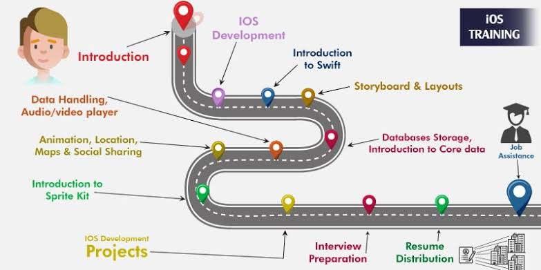
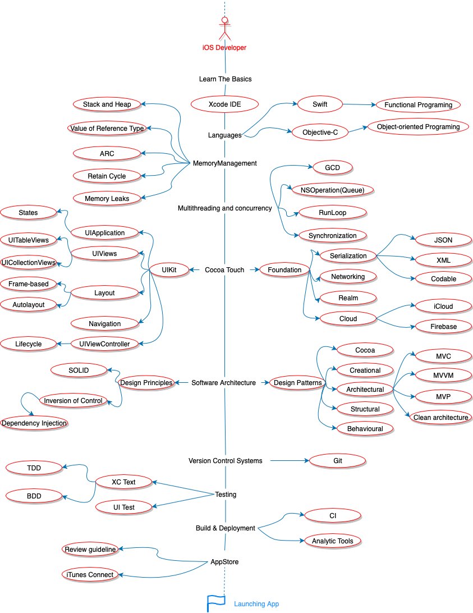

# 🚀 iOS Developer Roadmap 
 
## Nedir bu RoadMap?
RoadMap, başarılı bir geliştiricinin temel yetkinlikleridir genel çerçevede. iOS Platformunu tam olarak anlamak, temel metadolojisini kavramak isteyen tüm geliştricilerin bilmesi gereken bir yol haritasıdır. 

## Kimler İçin?
[]Uzman bir iOS geliştiricisi olmak isteyenler,
[]Mülakatlara hazırlananlar ve
[]iOS geliştiricisi olmak isteyen herkes içindir…

## Diagram Versiyonu 

## İDE
iOS geliştirmede kullandığımız İDE Xcode olarak karşımıza çıkmaktadır. Sadece MacOS işletim sistemlerinde çalışan bu ide eliğimiz ayağımız olacak bu süreçte. 

## Dil
Native geliştirmede Apple bize 2 seçenek sunmakta. Apple'ın 2014 de çıkardığı Swift ve Objective-C dilleri ile geliştirilmekte. Swift bir fonksiyonel programlama dilidir. Objective-C ise nesne tabanlı bir programla dilidir.

## Bellek Yönetimi
Bellek yönetimi, programımızın çalışma sürecince bellekten yer ayırma, kullanma ve işimiz bittiğinde belleği boşaltma adımlarını sağlar bize. İyi yazılmış bir program bellekte mümkün olduğunca az yer kaplamalıdır. Nesnelerin yaşam döngülerini kontrol etmemizi ve artık işlevi biten görevleri serbest bırakmamıza yardımcı olur. 

## Multithreading ve Concurrency
Bu terimleri çevirmek biraz yanlış olsada çoklu kullanım ve eşzamanlılık olarak çevirebiliriz. Aslında anlaşılması gereken önemli ve derinlemesine bir konudur bizim için. Kısıtlı olan işlemcilerimizi en performanslı şekilde kullanaran en kısa zamanda işlemlerimizi bitirmemiz gerekir. Eşzamanlılık ve çoklu kullanım kavramları birbirine çok karışan hatta birbiri yerine kullanılan kavramlardır genelde. Bu ikisinin farkını size şöyle bir örnekle anlatmak istiyorum size;
A konumundan B konumuna taşınacak kutularımız olsun elimizde. Eğer birden çok işçimiz varsa ve her işçimiz 1 kutu taşıyabiliyorsa bu çoklu kullanım(Paralellik) oluyor. Gene birden çok işçimizin olduğu fakat işçilerimizin birden çok kutu taşıdığını varsayarsakta bu eşzamanlılık oluyor. 
Fazlasıyla karmaşık geldiğinin farkındayım yakın zamanda daha detaylı anlatacağım.  

## Cocoa Touch
Temelde bir uygulama programlama arayüzüdür. Hareketleri algılama, animasyonlar gibi eylemleri yönetmemizi sağlar. UIKit kullanıcı etkileşimi (UX/UI) tarafında çalışırken, Foundation ise nesne davranışlarını,yönetimlerini sağlayan bir backend sistemidir. 

## Yazılım Mimarisi
iOS ekosistemi katmanlı bir mimariye sahiptir. İşletim sistemi yaptığımız uygulamarla donanım arasında bir köprü olarak çalışır. Bu yazılım mimarileride bu katmanları yönetmemizi ve erişimleri sağlamamızı sağlar. Bu konuda oldukça ilgi çekici ve uzun bir konudur. MVC, MVP, MVVM, Viper, SOLID gibi mimarileri daha ayrıntılı  bahsedeceğiz. 

## Versiyon Kontrol sistemi 
VCS, bize uygulamamızın sürümlerini kontrol altına almamızı, eski sürümlerdeki dosyaları kaydetmemizi değişikleri takip edebilmemizi sağlar. Ekip çalışmalarındaki iş bölümlerinde ortak bir noktadan çalışabilmemizede olanak sağlar. 

## Test
Uygulamalarımızın testlerinin yapıldığı kısımlardır. Temelde Unit Test olarak geçer. İçerisinde XC Test ve UI Test olarak dallanır. Benim bu neymiş böyle diye girip sonra aşık olup vazgeçemediğim TDD metedolojiside burda geliştirilmektedir.

## Build Deployment
Son birkaç adım artık. Geliştirdiğimiz uygulamımızı inşa edip dağıtma işlemlerini bu adım gerçekleştiririz. 

## Appstore
iCloud bağlantımızıda yaptıktan sonra artık tek yapmamız gereken uygulamamızı AppStore hesabımızda yayınlamak. Tabiki Reject yemezsek :D Apple'ın bu reject politikasını anlayana kadar sizi biraz hayattan soğutabilir ama sabredip kavrayınca çok daha hızlı ilerleyen bir adımdır..

Tebrikler artık yayınlanmış kaliteli bir uygulamamız var...

## 📝 Metin Hali
[Daha kapsamlı Metin hali...](RoadMap/RoadMap.md)

